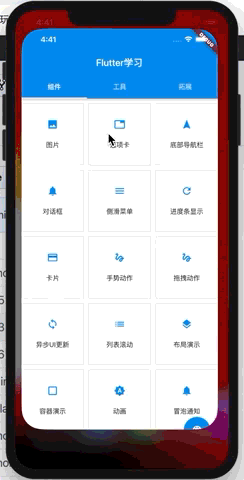
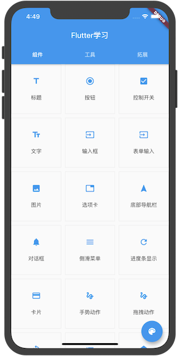
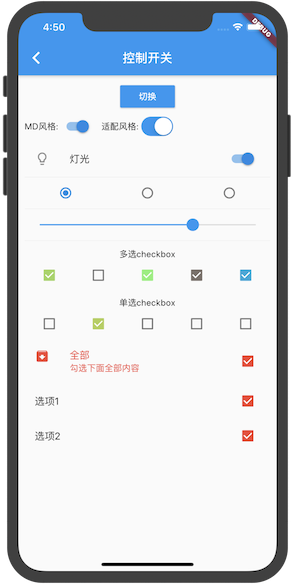
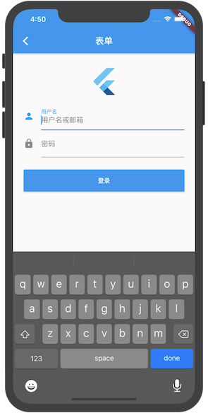
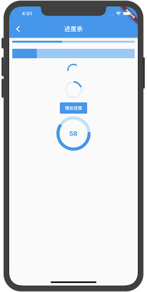
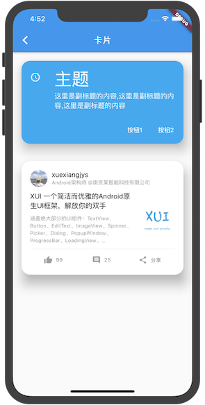
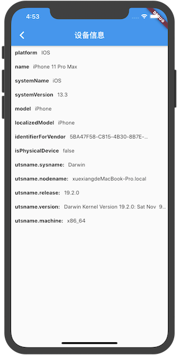
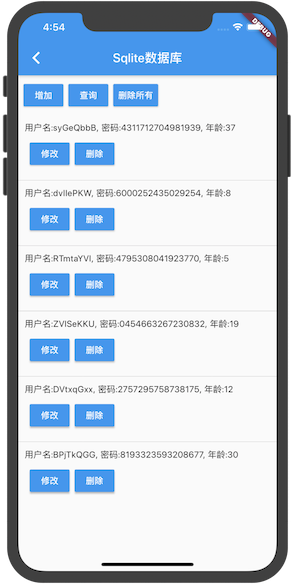

# flutter_learn

Flutter使用指南,包含众多组件和插件的使用, 是学习和体验flutter组件的小Demo


## 演示(请Star支持)



## 部分截图

 &emsp;  &emsp; 

 &emsp;  &emsp; 

 &emsp;  &emsp; 

### Demo下载

> 演示程序大概20M，项目比较大，推荐使用蒲公英下载。

#### 蒲公英下载

> 蒲公英下载的密码: xuexiangjys

[](https://www.pgyer.com/flutter_learn)


#### Github下载

[](https://github.com/xuexiangjys/XUI/blob/master/apk/xuidemo.apk?raw=true)


## 运行方式

* 查看一下版本号是否正确
```
flutter --version
```

* 运行以下命令查看是否需要安装其它依赖项来完成安装
```
flutter doctor
```

* 运行启动您的应用
```
flutter packages get 
flutter run
```


## 依赖库说明

* [非常好用的网络请求库 dio](https://pub.dev/packages/dio)
* [FlutterToast](https://pub.dev/packages/fluttertoast)
* [mmkv_flutter](https://pub.dev/packages/mmkv_flutter)
* [shared_preferences](https://pub.dev/packages/shared_preferences)
* [url_launcher](https://pub.dev/packages/url_launcher)
* [图片选择 image_picker](https://pub.dev/packages/image_picker)
* [sqlite数据库 sqflite](https://pub.dev/packages/sqflite)
* [页面路由神器 fluro](https://pub.dev/packages/fluro)
* [网页加载 flutter_webview_plugin](https://pub.dev/packages/flutter_webview_plugin)
* [loading加载动画 flutter_spinkit](https://pub.dev/packages/flutter_spinkit)
* [事件工具 event_bus](https://pub.dev/packages/event_bus)
* [轮播图组件 flutter_swiper](https://pub.dev/packages/flutter_swiper)
* [刷新组件 flutter_easyrefresh](https://pub.dev/packages/flutter_easyrefresh)
* [非常好用的数据共享工具 provider](https://pub.dev/packages/provider)
* [时间选择器 flutter_datetime_picker](https://pub.dev/packages/flutter_datetime_picker)
* [多图片选择 multi_image_picker](https://pub.dev/packages/multi_image_picker)
* [极光推送 jpush_flutter](https://pub.dev/packages/jpush_flutter)
* [bugly统计 flutter_bugly](https://pub.dev/packages/flutter_bugly)
* [设备信息 device_info](https://pub.dev/packages/device_info)


## 非常感谢

* [阿里巴巴的入门级项目 flutter-go](https://github.com/alibaba/flutter-go)
* [flutter实战](https://book.flutterchina.club/)
